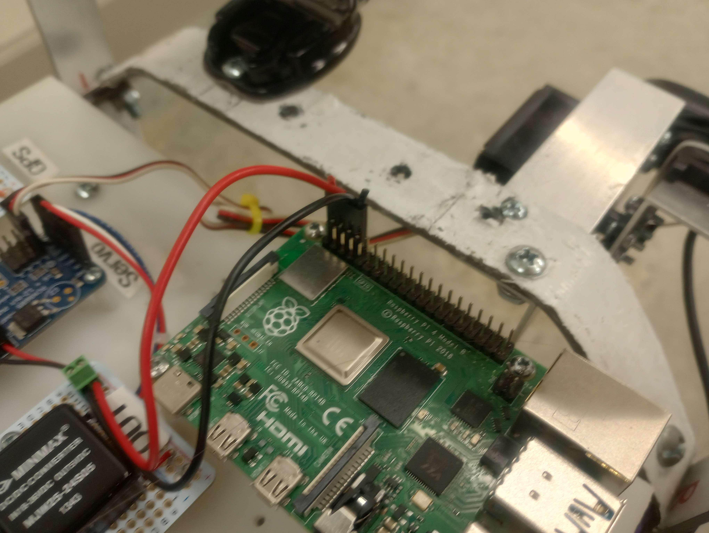
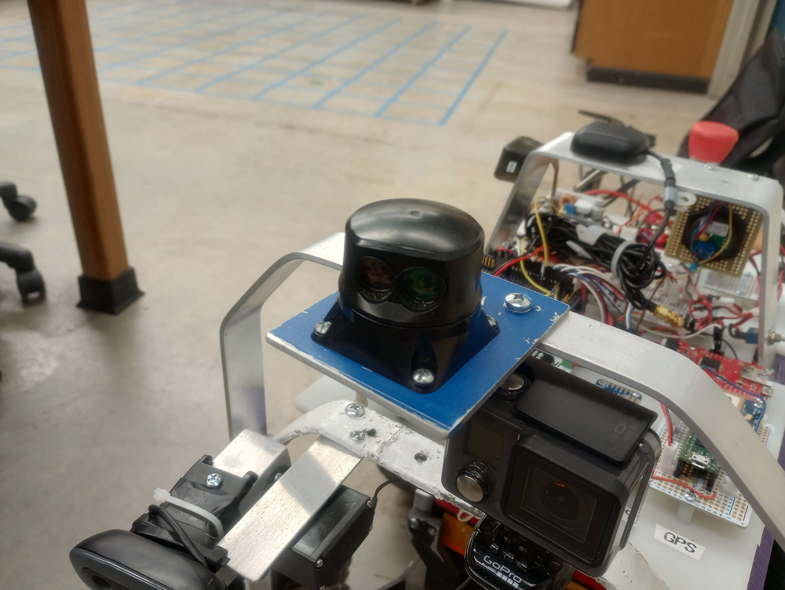

## Engineering Capstone Design Project - LiDAR Systems Code

**Goal:** 
Computer Vision control for the UAH's legacy QuadRover project in the following ways:

    1) Process LiDAR distance and angle data at present and past saved instances
    2) Control rover position in either "Obstacle Avoidance" or "Landmark Honing" modes
    3) Output data to mission report file via radio module
  
**Concepts Used:** 
- UART Serial Communication
- Threading
- 

  
**Hardware:**
- SF45 Lightware LiDAR Sensor
- Raspberry Pi 4B
- LoRa Pi Hat Radio Module

## Hardare Setup

